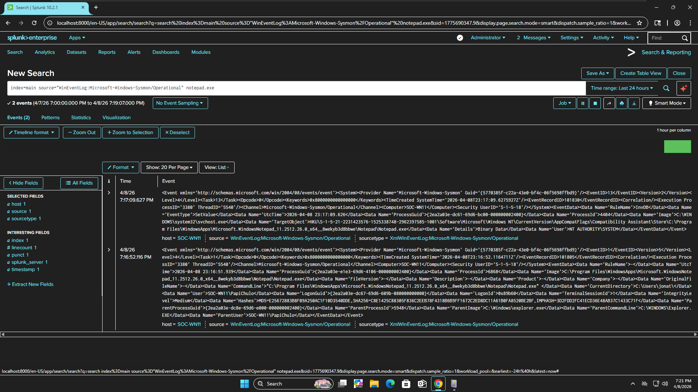

# Notepad Process Investigation

## Date

3/30/2026 1:17:17.574 AM

## Scenario

I opened Windows Notepad and searched for the corresponding Sysmon event in Splunk.

## Summary

A Sysmon Event ID 1 process creation event for `Notepad.exe` was identified in Splunk on host `SOC-WN11`.

## Evidence

- Event ID: 1
- Image: `C:\Program Files\WindowsApps\Microsoft.WindowsNotepad...\Notepad.exe`
- CommandLine: `"C:\Program Files\WindowsApps\Microsoft.WindowsNotepad...\Notepad.exe"`
- User: `SOC-WN11\PapiChulo`
- ParentImage: `C:\Windows\explorer.exe`
- Host: `SOC-WN11`

## Timeline

I opened Notepad. A Sysmon Event ID 1 record was identified in Splunk. The event was reviewed and documented.

## IOCs

None identified in the fields reviewed.

## Severity

Informational

## Escalation Decision

Activity was reviewed in Splunk and validated as user activity. No escalation needed.

## Next Steps

Review and document a PowerShell process creation event.

## Screenshot

