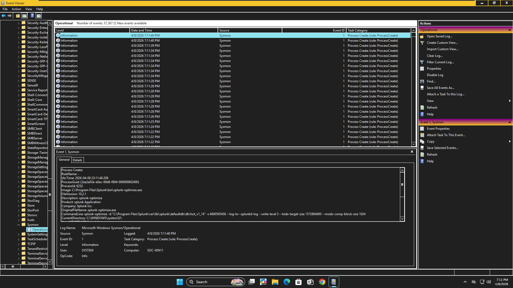
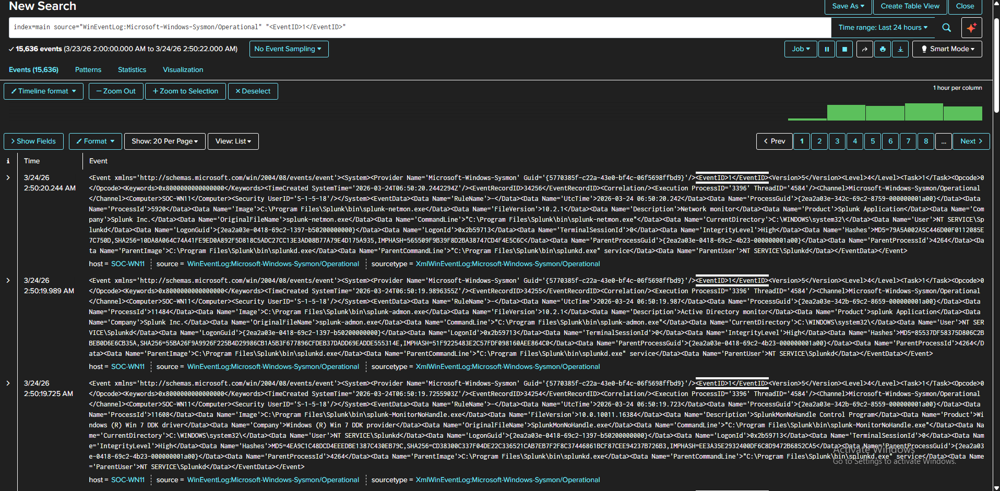

# Sysmon and Splunk Lab Setup

## Purpose

This note documents the setup of my beginner SOC home lab using a Windows 11 virtual machine, Microsoft Sysmon, Windows Event Viewer, and Splunk Enterprise.

## Lab Environment

- Virtualization Platform: VMware Workstation
- Endpoint: Windows 11 virtual machine
- Hostname: SOC-WN11
- Logging Tool: Microsoft Sysmon
- SIEM: Splunk Enterprise

## Setup Summary

I built a Windows 11 virtual machine to act as a beginner SOC lab endpoint. I installed and configured Microsoft Sysmon to generate endpoint telemetry, then verified that Sysmon logs were visible in Windows Event Viewer.

After confirming local logging, I used Splunk Enterprise to ingest and search Windows and Sysmon logs from the lab machine.

## Sysmon Verification

Sysmon logs were verified in Windows Event Viewer under:

```text
Applications and Services Logs > Microsoft > Windows > Sysmon > Operational
```
## Splunk Verification

Splunk was used to search and review Sysmon logs from the Windows 11 lab host.

Example search:

```spl
index=main source="WinEventLog:Microsoft-Windows-Sysmon/Operational"
```

## Log Sources Reviewed

- WinEventLog:Application
- WinEventLog:Security
- WinEventLog:System
- WinEventLog:Microsoft-Windows-Sysmon/Operational

## Skills Practiced

- Windows VM setup
- Sysmon installation and verification
- Windows Event Viewer log review
- Splunk log ingestion validation
- Basic SPL searching
- Beginner endpoint event analysis

## Screenshots




